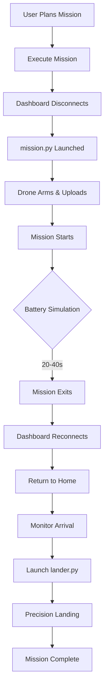

# 🚁 Autonomous Drone Mission Control System

A comprehensive autonomous drone simulation platform featuring intelligent mission execution, battery-aware recovery, and precision landing using computer vision.

[](https://www.youtube.com/watch?v=fPyEu_ca69Q)

[](https://youtu.be/ZQSDnhsUc24)
---

## 📋 Table of Contents

- [Overview](#overview)
- [Features](#features)
- [System Architecture](#system-architecture)
- [Installation](#installation)
- [Quick Start](#quick-start)
- [Module Documentation](#module-documentation)
- [Workflow](#workflow)
- [Future Roadmap](#future-roadmap)
- [Contributing](#contributing)

---

## 🎯 Overview

This system provides a complete autonomous drone mission workflow with realistic battery simulation, intelligent recovery mechanisms, and precision landing capabilities. Built for PX4 SITL with ROS2 integration, it demonstrates advanced drone autonomy workflows in a safe, repeatable simulation environment.

**Key Highlights:**
- 🤖 Fully automated mission execution from upload to precision landing
- 🔋 Realistic battery simulation with autonomous recovery
- 🎯 Computer vision-based precision landing (ArUco + CNN)
- 🛡️ Robust error handling with retry logic and manual fallback
- 🗺️ Interactive mission planning with real-time telemetry

---

## ✨ Features

### ✅ Implemented Features

#### 1. **Mission Planning & Execution**
- ✅ Interactive map-based waypoint creation
- ✅ Click-to-add waypoints with visual feedback
- ✅ Real-time mission preview and editing
- ✅ Automatic mission upload and execution
- ✅ Support for custom altitude and speed parameters
- ✅ Test missions (5m square pattern)

#### 2. **Dashboard & Ground Control**
- ✅ Modern PyQt5-based GCS interface
- ✅ Real-time telemetry display (position, speed, altitude, mode)
- ✅ Map visualization with background imagery
- ✅ Interactive controls (ARM, DISARM, TAKEOFF, LAND, RTL)
- ✅ System console with detailed logging
- ✅ Waypoint management and tracking
- ✅ Pan and zoom functionality on map

#### 3. **Autonomous Recovery System**
- ✅ Battery simulation with random interruption (20-40 seconds)
- ✅ Automatic reconnection after mission completion (3 retry attempts)
- ✅ Intelligent return-to-home navigation
- ✅ Goto waypoint command for smooth transitions
- ✅ RTL fallback mechanism
- ✅ Home position monitoring and arrival detection

#### 4. **Precision Landing**
- ✅ ArUco marker detection for visual positioning
- ✅ Real-time camera feed processing (ROS2 integration)
- ✅ Offboard control mode for precision maneuvers
- ✅ Multi-phase landing (searching → adjusting → descending → landing)
- ✅ Failsafe landing when marker not detected
- ✅ Timeout protection and error handling

#### 5. **Error Handling & Reliability**
- ✅ Connection retry logic (3 attempts)
- ✅ Arming retry mechanism with verification
- ✅ Goto/RTL dual-fallback system
- ✅ Manual intervention popups for critical failures
- ✅ Comprehensive logging and debugging tools
- ✅ Process monitoring and recovery

#### 6. **Integration & Compatibility**
- ✅ MAVSDK Python integration for drone control
- ✅ ROS2 Humble support for sensor data
- ✅ PX4 SITL simulation compatibility
- ✅ Gazebo world integration
- ✅ Docker containerization support
- ✅ Cross-platform GUI (Linux, macOS, Windows with X11)

---

## 🏗️ System Architecture

```
┌─────────────────────────────────────────────────────────────┐
│                     Dashboard (dashboard.py)                 │
│  ┌─────────────┐  ┌──────────────┐  ┌──────────────┐       │
│  │ Mission Plan│  │  Telemetry   │  │  Map View    │       │
│  │   Editor    │  │   Display    │  │  (Interactive)│       │
│  └─────────────┘  └──────────────┘  └──────────────┘       │
└────────────┬────────────────────────────────────────────────┘
             │
             ├─► MAVSDK Connection (UDP :14540)
             │
┌────────────▼────────────────────────────────────────────────┐
│                   PX4 Autopilot (SITL)                       │
│  ┌──────────────┐  ┌──────────────┐  ┌──────────────┐      │
│  │   MAVLink    │  │  uXRCE-DDS   │  │   Gazebo     │      │
│  │   Bridge     │  │    Bridge    │  │  Simulation  │      │
│  └──────────────┘  └──────────────┘  └──────────────┘      │
└────────────┬────────────────────────────────────────────────┘
             │
             ├─► Mission Executor (mission.py) - Subprocess
             ├─► Precision Lander (lander.py) - Subprocess
             │
┌────────────▼────────────────────────────────────────────────┐
│                   ROS2 (Humble)                              │
│  ┌──────────────┐  ┌──────────────┐  ┌──────────────┐      │
│  │   Camera     │  │   Transform  │  │    Topics    │      │
│  │    Node      │  │     Frames   │  │  Publishing  │      │
│  └──────────────┘  └──────────────┘  └──────────────┘      │
└─────────────────────────────────────────────────────────────┘
```

### Component Overview

| Component | Technology | Purpose |
|-----------|-----------|---------|
| **Dashboard** | PyQt5, MAVSDK | Main GCS interface and mission control |
| **Mission Executor** | MAVSDK, Python asyncio | Autonomous waypoint navigation |
| **Precision Lander** | ROS2, OpenCV, MAVSDK | Computer vision-based landing |
| **PX4 SITL** | C++, MAVLink | Flight controller simulation |
| **Gazebo** | Physics Engine | 3D world simulation |
| **ROS2 Bridge** | uXRCE-DDS | PX4 ↔ ROS2 communication |

---

## 🚀 Installation

### Prerequisites

- Ubuntu 22.04 (recommended) or compatible Linux distribution
- Docker (for containerized deployment)
- X11 server (for GUI display)

### Option 1: Docker Installation (Recommended)

```bash
# Clone the repository
git clone https://github.com/sim-daas/dronesim.git
cd dronesim

# Build the Docker image
docker build -t drone-mission-sim .

# Run the container
docker run --rm -it \
  --name drone-mission-sim \
  -e DISPLAY=$DISPLAY \
  -v /tmp/.X11-unix:/tmp/.X11-unix \
  -v $(pwd)/src/dronesim:/root/dronews/src/dronesim \
  drone-mission-sim
```

### Option 2: Manual Installation

```bash
# Install system dependencies
sudo apt-get update
sudo apt-get install -y python3-pip ros-humble-desktop gazebo

# Install Python dependencies
pip3 install mavsdk asyncio opencv-python pyqt5 numpy

# Clone PX4 Autopilot
git clone https://github.com/PX4/PX4-Autopilot.git --recursive
cd PX4-Autopilot
make px4_sitl gazebo

# Source ROS2
source /opt/ros/humble/setup.bash
```

---

## 🎮 Quick Start

### 1. Start PX4 SITL Simulation

```bash
cd PX4-Autopilot
make px4_sitl gazebo
```

### 2. Launch Dashboard

```bash
cd dronesim
python3 dashboard.py
```

### 3. Execute Your First Mission

1. **Connect**: Click "Connect" button in the dashboard
2. **Plan Mission**: Click on the map to add waypoints
3. **Configure**: Set altitude (5-20m) and speed (3-10 m/s) in Parameters tab
4. **Execute**: Click "Execute Mission" to start autonomous flight
5. **Monitor**: Watch real-time telemetry and mission progress
6. **Recovery**: System automatically returns home and lands after battery simulation

### 4. Test Precision Landing

```bash
# After mission returns home
python3 lander.py
```

---

## 📚 Module Documentation

### dashboard.py
**Main Ground Control Station Interface**

- **Purpose**: Primary user interface for mission planning and monitoring
- **Key Features**:
  - Interactive map with waypoint placement
  - Real-time telemetry display
  - Mission execution and monitoring
  - Automatic recovery coordination
- **Dependencies**: PyQt5, MAVSDK, asyncio

**Key Functions**:
```python
execute_mission()          # Launch mission executor subprocess
monitor_mission_process()  # Track mission execution
start_recovery_process()   # Initiate auto-recovery
launch_precision_landing() # Start precision landing sequence
```

---

### mission.py
**Autonomous Mission Executor**

- **Purpose**: Standalone mission execution with battery simulation
- **Key Features**:
  - Automatic drone arming with retry logic
  - Mission upload and verification
  - Random duration simulation (20-40s)
  - Progress monitoring
- **Execution**: Runs as subprocess, exits to trigger recovery

**Workflow**:
```python
1. Connect to drone
2. Arm drone (3 retry attempts)
3. Upload mission waypoints
4. Start mission execution
5. Monitor progress with timeout
6. Exit (triggers dashboard recovery)
```

---

### lander.py
**Precision Landing System**

- **Purpose**: Computer vision-based precision landing
- **Key Features**:
  - ArUco marker detection (DICT_4X4_50)
  - ROS2 camera feed integration
  - Offboard mode control
  - Multi-phase landing algorithm
  - Failsafe timeout protection
- **Dependencies**: ROS2, OpenCV, cv_bridge, MAVSDK

**Landing Phases**:
```
searching → adjusting → descending → landing
```

**Key Parameters**:
```python
marker_size = 0.5m              # ArUco marker dimensions
landing_altitude = 5.0m         # Initial precision landing altitude
final_altitude = 1.0m           # Final descent altitude
position_tolerance = 0.2m       # Centering accuracy
detection_timeout = 20.0s       # Max time to find marker
```

---

## 🔄 Workflow

### Complete Mission Lifecycle



### Detailed Steps

#### Phase 1: Mission Execution (mission.py)
1. Dashboard user clicks "Execute Mission"
2. Dashboard disconnects from drone to prevent conflicts
3. Launches `mission.py` as separate subprocess
4. `mission.py` connects and arms drone (with retries)
5. Uploads waypoints and starts mission
6. Runs for random 20-40 seconds (battery simulation)
7. Exits, signaling dashboard

#### Phase 2: Recovery (dashboard.py)
1. Detects mission completion
2. Automatically reconnects (3 retry attempts)
3. Sends drone to home position using goto command
4. Monitors arrival at home (1m accuracy)
5. Launches precision landing when home reached

#### Phase 3: Precision Landing (lander.py)
1. Connects to drone and camera feed
2. Descends to landing altitude (5m)
3. Starts offboard mode
4. Searches for ArUco marker
5. Centers drone over marker
6. Executes final descent and landing

---

## 🗺️ Future Roadmap

### 🔜 Planned Features

#### Near-Term (Q1-Q2 2024)

- [ ] **Advanced Mission Types**
  - [ ] Survey missions with grid patterns
  - [ ] Orbit/circle around point of interest
  - [ ] Corridor scan missions
  - [ ] Multi-altitude waypoints

- [ ] **Enhanced Precision Landing**
  - [ ] CNN-based landing zone classification
  - [ ] Multiple marker detection and selection
  - [ ] Landing on moving platforms
  - [ ] IR marker support for low-light conditions

- [ ] **Improved Telemetry**
  - [ ] 3D flight path visualization
  - [ ] Real-time video streaming in dashboard
  - [ ] Mission replay and analysis
  - [ ] Export flight logs (KML, CSV)

- [ ] **Safety Features**
  - [ ] Geofencing with configurable boundaries
  - [ ] No-fly zone detection and avoidance
  - [ ] Emergency stop button
  - [ ] Battery voltage monitoring (real values)

#### Mid-Term (Q3-Q4 2024)

- [ ] **Multi-Drone Support**
  - [ ] Swarm mission coordination
  - [ ] Collision avoidance between drones
  - [ ] Leader-follower formations
  - [ ] Distributed task allocation

- [ ] **Computer Vision Enhancements**
  - [ ] Object detection and tracking (YOLOv8)
  - [ ] Obstacle avoidance using depth cameras
  - [ ] Semantic segmentation for terrain analysis
  - [ ] Visual odometry for GPS-denied navigation

- [ ] **Advanced Navigation**
  - [ ] SLAM integration for indoor navigation
  - [ ] Path planning with obstacle avoidance
  - [ ] Dynamic replanning during flight
  - [ ] Terrain following mode

- [ ] **Hardware Integration**
  - [ ] Real drone hardware support (Pixhawk)
  - [ ] LiDAR sensor integration
  - [ ] Stereo camera support
  - [ ] Companion computer setup guides

#### Long-Term (2025+)

- [ ] **AI/ML Integration**
  - [ ] Reinforcement learning for optimal path planning
  - [ ] Predictive battery management
  - [ ] Autonomous decision-making
  - [ ] Weather-aware flight planning

- [ ] **Cloud Integration**
  - [ ] Cloud-based mission planning
  - [ ] Multi-user collaboration
  - [ ] Fleet management dashboard
  - [ ] Real-time mission sharing

- [ ] **Extended Capabilities**
  - [ ] Payload delivery missions
  - [ ] Infrastructure inspection workflows
  - [ ] Search and rescue patterns
  - [ ] Agricultural survey missions

---

## 🛠️ Development

### Project Structure

```
dronesim/
├── dashboard.py          # Main GCS interface
├── mission.py            # Mission executor
├── lander.py             # Precision landing
├── test_mission_simple.py # Testing utilities
├── back.png              # Map background image
├── Dockerfile            # Container configuration
├── README.md             # This file
├── px4_ros_com/          # ROS2-PX4 bridge
│   ├── include/
│   ├── src/
│   └── README.md
└── mavsdk_examples/      # Reference implementations
    ├── mission.py
    ├── mission_raw.py
    └── mission_import.py
```

### Running Tests

```bash
# Test simple mission upload
python3 test_mission_simple.py

# Test 5m square mission from dashboard
# 1. Connect to drone
# 2. Click "Test 5m Square Mission"

# Debug mission system
# 1. Connect to drone
# 2. Click "Debug Mission System"
```

### Key Technologies

- **Flight Controller**: PX4 Autopilot
- **Middleware**: MAVLink, uXRCE-DDS
- **Control Library**: MAVSDK Python
- **GUI Framework**: PyQt5
- **Computer Vision**: OpenCV, ArUco
- **ROS2**: Humble Hawksbill
- **Simulation**: Gazebo Classic
- **Containerization**: Docker

---

## 📝 Contributing

We welcome contributions! Please see our contribution guidelines:

1. Fork the repository
2. Create a feature branch (`git checkout -b feature/amazing-feature`)
3. Commit your changes (`git commit -m 'Add amazing feature'`)
4. Push to the branch (`git push origin feature/amazing-feature`)
5. Open a Pull Request

### Development Guidelines

- Follow PEP 8 for Python code
- Add docstrings to all functions
- Include unit tests for new features
- Update README.md with new features
- Test with PX4 SITL before submitting

---

## 📄 License

This project is licensed under the BSD 3-Clause License - see the [LICENSE](px4_ros_com/LICENSE) file for details.

---

## 🙏 Acknowledgments

- PX4 Development Team for the autopilot software
- MAVSDK developers for the control library
- ROS2 community for middleware support
- OpenCV contributors for computer vision tools

---

## 📧 Contact & Support

- **Issues**: [GitHub Issues](https://github.com/sim-daas/dronesim/issues)
- **Discussions**: [GitHub Discussions](https://github.com/sim-daas/dronesim/discussions)
- **Email**: support@dronesim.io
- **Documentation**: [Wiki](https://github.com/sim-daas/dronesim/wiki)

---

**Built with ❤️ for autonomous drone research and education**
